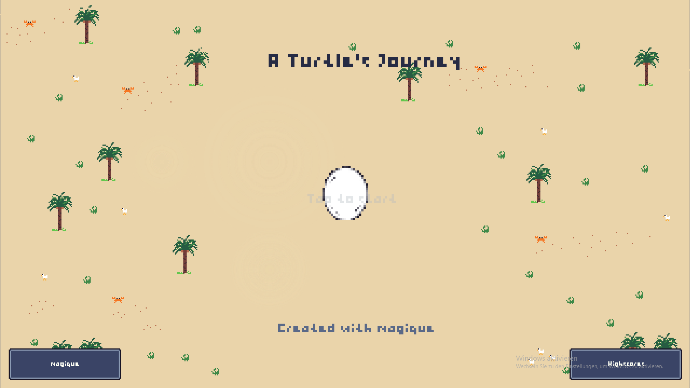
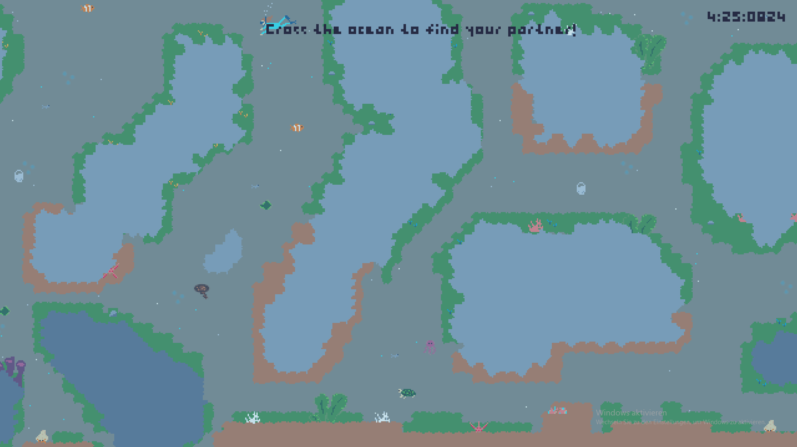

## A turtle's journey

`A turtles's journey` is an arcade-style game for a 1-day game jam. It was made with a team of two, splitting asset work
and programming. It ended up being the winning entry!

It's written from scratch using my engine framework [_magique_](https://github.com/gk646/magique).

My personal highscore: `0:50:0153`

### Backstory

The theme of the game is based on a turtles journey from hatching, the hard way into the ocean and then finding a
partner and starting the cycle anew.

It draws directly to the biology and challenges a turtle faces, like plastic waste, oil, trash or cars when crossing the
street.

### Gameplay

It's divided into 3 stages:

- **Beach**
    - Break the egg by clicking it with the mouse to hatch the turtle
    - Click the correct keys when they are in the target area to move the turtle of the beach
- **Streets**
    - Cross the _(many)_ streets to reach the ocean
    - Watch out for trucks and cars moving at different speeds
- **Ocean**
    - Find your partner by navigating the ocean terrain
    - Collect food to gain a speedup, avoid harmful obstacles to not get slowed down

Your times are recorded in the high-score screen reached via the main menu.
A save file is created in the game directory that saves all highscores.